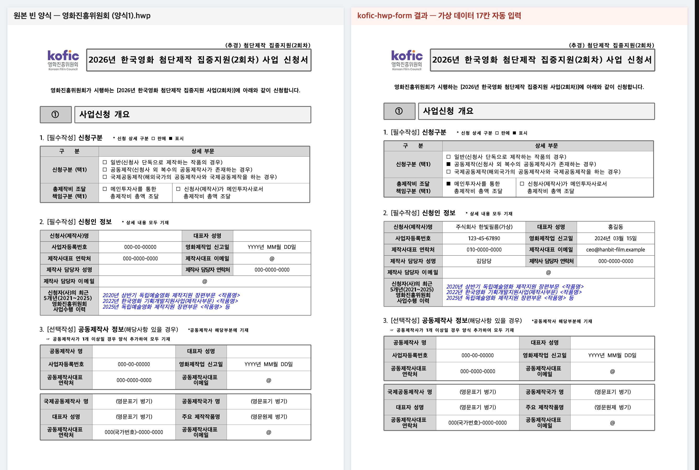

# kofic-hwp-form — 한글(HWP) 양식 학습·문서 자동 완성 스킬

> 우리 기관 한글 문서를 한 번 보여 주면, 다음부터는 **기초 정보만 말해도 같은 서식의 HWP/HWPX 문서가 완성·검수**되어 나옵니다.
> 영화진흥위원회 AX 실무 강의에서 출발했고, **한글로 일하는 모든 공무원·공공기관 종사자**를 위해 만들었습니다.



<sub>영화진흥위원회 누리집 공개 양식 「(양식1) 첨단제작 집중지원 사업 신청서」에 **가상 정보** 17칸을 자동 입력한 결과(원본 서식 유지, 체크박스 ■ 선택 포함)</sub>

## 무엇을 해 주나요

| 단계 | 에이전트에게 이렇게 말하면 | 스킬이 하는 일 |
| --- | --- | --- |
| 1. 양식 학습 | “이 한글 파일을 우리 부서 양식으로 학습해 줘” | 문서 유형(공고문·기안문·보고서·계획서·보도자료·회의록·신청서·계약서) 판별, 입력 칸(빈칸·예시 표기·체크박스·표·누름틀) 탐지, **원본 오류 점검**, 양식함에 저장 |
| 2. 정보 입력 | “사업명은 ○○, 기간은 10월 1일부터…” | 칸별 입력값 정리, 모르는 사실은 지어내지 않고 되물음 |
| 3. 문서 완성 | “새 공고문 만들어 줘” | 원본 파일 안에서 바뀐 칸만 교체(글꼴·표·쪽 설정 보존), 필요하면 자동 복구 경로 |
| 4. 검수 | (자동) | 값 누락 · **지난 문서 값 잔존** · 미기입 칸 · **날짜-요일 불일치** · 공문서 표기법 · 개인정보 · 파일 구조 |

실제 공개 문서로 검증했습니다: 입찰공고문 재활용(HWP 그대로), 8쪽 신청서 17칸, 11쪽 제작계획서의 복잡한 표, 표준 기안문 누름틀 23칸. 입찰공고문을 학습시키자 원본의 **“2025. 8. 10.(월)” 날짜-요일 오류**(2026년이 맞음)를 바로 찾아냈습니다. → [PRD 9장 검증 결과](docs/PRD.md#9-가능-여부-판단--결론-가능-mvp-구현실문서-검증-완료)

## 설치 (한 줄)

필요한 것: 인터넷 연결. Node.js 20+가 없으면 설치 스크립트가 개인 폴더에 자동으로 설치합니다(관리자 권한 불필요). 필수 도구 kordoc·rhwp도 함께 설치됩니다(약 60MB).

**macOS · Linux · WSL**

```bash
curl -fsSL https://raw.githubusercontent.com/reallygood83/kofic-form/main/install.sh | bash
```

**Windows (PowerShell)**

```powershell
irm https://raw.githubusercontent.com/reallygood83/kofic-form/main/install.ps1 | iex
```

설치하면 `~/.agents/skills/kofic-hwp-form`에 스킬이 놓이고, 컴퓨터에 있는 에이전트 폴더에 자동으로 연결됩니다.

| 에이전트 | 연결 위치 | 비고 |
| --- | --- | --- |
| **Aside** | `~/.aside/u/<계정>/skills/user/kofic-hwp-form` | 복사 설치, 새 대화부터 인식 |
| **Claude Code** | `~/.claude/skills/kofic-hwp-form` | 또는 플러그인: `/plugin marketplace add reallygood83/kofic-form` → `/plugin install kofic-hwp-form@kofic-form` |
| **Codex** | `~/.agents/skills`, `~/.codex/skills` | |
| **Grok Build** | `~/.grok/skills` (+`~/.agents/skills`) | `/kofic-hwp-form` 슬래시 명령 |
| **Muse Code** | `~/.agents/skills` 자동 인식 | 또는 `muse skills install ~/.agents/skills/kofic-hwp-form --scope user` |
| **Grok Bot · Muse(클라우드 컴퓨터)** | 아래 “클라우드 에이전트” 참고 | |

다른 방법: `npx skills add reallygood83/kofic-form` (스킬 CLI가 설치된 에이전트를 찾아 복사, 첫 실행 때 도구 자동 설치)

### 클라우드 에이전트(Grok Bot · Muse)

클라우드 컴퓨터에서 일하는 에이전트에게 채팅으로 이렇게 부탁하세요.

```text
이 컴퓨터에서 다음을 실행해 줘:
curl -fsSL https://raw.githubusercontent.com/reallygood83/kofic-form/main/install.sh | bash
그다음 ~/.agents/skills/kofic-hwp-form/SKILL.md 를 읽고, 그 절차를 "kofic-hwp-form" 스킬로 저장해 줘.
앞으로 내가 한글 파일을 올리면 그 절차대로 양식을 학습하고 문서를 만들어 줘.
```

- Grok Bot: 저장된 스킬은 **Marketplace → Your plugins → Manage plugins and skills → Private skills**에서 확인, 채팅에서 `/`로 불러옵니다.
- Muse(Meta AI 앱): 사용자 스킬 설치 기능이 없어 위 부탁처럼 “절차를 따르라”는 지시로 사용합니다. 파일은 대화에 첨부하세요.

### 설치 확인

```bash
node ~/.agents/skills/kofic-hwp-form/scripts/hwpform.mjs doctor      # 환경 점검
node ~/.agents/skills/kofic-hwp-form/scripts/selftest.mjs             # 자체 시험 15항목
```

## 사용 예시

### 에이전트와 대화로

```text
나: (입찰공고문.hwp 첨부) 이걸 우리 팀 입찰공고 양식으로 학습해 줘.
에이전트: 공고문(입찰)으로 학습했습니다. 바뀌는 칸은 공고명·사업금액·용역기간·제출 일시·문의처 등 17곳입니다.
         원본의 제출 마감일시 "2025. 8. 10.(월)"은 실제로 일요일이라 연도 확인이 필요합니다.
나: 이번엔 "공공기관 업무 AI 전환(AX) 실무교육 운영 용역", 3천만 원, 3개월, 10월 5일~16일 접수로 만들어 줘.
에이전트: 완성했습니다(HWP 유지, 3쪽). 값 6건 반영, 공고번호 치환 1건, 지난 값 잔존 없음, 날짜·요일 이상 없음.
```

### 명령으로 (강의 실습·자동화)

```bash
H="node ~/.agents/skills/kofic-hwp-form/scripts/hwpform.mjs"
$H learn 입찰공고문.hwp --name "용역 입찰공고문" --org "영화진흥위원회"   # 양식 학습
$H values 용역-입찰공고문 --out 값.json                                  # 입력값 틀
$H fill 용역-입찰공고문 --values 값.json --replace "입찰 2026-10-1호=>입찰 2026-11-1호" --out 새공고.hwp
$H builtin gian && $H fill gian --values 기안값.json --out 협조요청.hwpx   # 표준 기안문
$H generate --md 모집공고.md --preset notice --out 모집공고.hwpx          # 새 문서 생성
$H preview 새공고.hwp                                                    # 쪽별 미리보기
```

양식함 위치: `~/Documents/hwp-form-library` (환경변수 `HWPFORM_HOME`으로 변경). 만든 양식은 `pack <ID>`로 묶어 동료에게 주고, 동료는 `unpack`으로 등록합니다.

## 어떻게 동작하나요

- **읽기·반영·검수: [kordoc](https://github.com/chrisryugj/kordoc)** — 한국 공문서 파서. 표·병합 셀을 구조 그대로 읽고, 편집 내용을 원본 파일 안에서 바뀐 부분만 교체하는 서식 보존 패치, 공문서 생성 프리셋, 공문서 표기법 검수, 개인정보 탐지를 제공합니다.
- **변환·누름틀: [rhwp](https://github.com/edwardkim/rhwp)** — Rust+WebAssembly HWP/HWPX 엔진(`@rhwp/core`). HWP↔HWPX 변환(내용 손실 보고 포함), HWP 누름틀 채우기, 줄 배치 재계산.
- **이 스킬이 더하는 것**: 양식 학습(입력 칸·체크박스·표·섹션별 키), 문서 유형 분류, 양식함, 표 좌표 기반 정밀 채우기와 **자동 복구 3단계**(HWP 직접 → HWPX 작업본 → 라벨 기반), 지난 문서 재활용 안전장치(잔존 값·날짜-요일 검사), 다중 에이전트 설치.

자세한 설계: [PRD](docs/PRD.md) · [개발 명세(SPEC)](docs/SPEC.md) · [스킬 본문](skills/kofic-hwp-form/SKILL.md)

## 강의·실습 자료

[`examples/kofic-practice`](examples/kofic-practice/) — 영화진흥위원회 공개 문서로 하는 4가지 실습(입찰공고 재활용, 신청서 채우기, 기안문, 내 양식 만들기와 공유). 실습 파일은 누리집에서 내려받는 스크립트로 제공합니다(저장소에 기관 원본을 싣지 않음).

## 주의

- **최종 확인은 한글에서** 열어서 하세요. 내용 보존은 자동 검증하지만, 쪽 넘김 등 조판은 한글에서 다시 계산됩니다.
- HWP 원본에서 글상자·복잡한 표 때문에 복구 경로를 거치면 결과를 **HWPX로 저장**합니다. 한글에서 열어 [다른 이름으로 저장 → HWP] 하면 됩니다.
- 표 **행 추가**, 그림·도장 삽입은 아직 지원하지 않습니다(한글에서 마무리).
- 에이전트가 문서를 읽으면 그 내용은 해당 AI 모델로 전달됩니다. 실습은 가상 정보로 하고, 실제 업무 문서는 **기관의 생성형 AI 이용 지침**을 먼저 확인하세요. 스킬의 문서 처리 자체는 모두 내 컴퓨터에서 이뤄집니다.

## 크레딧·라이선스

- kordoc — © chrisryugj, MIT · rhwp — © edwardkim, MIT · 이 저장소 — MIT © 2026 Moon-Jung Kim (reallygood83, 유튜브 「배움의 달인」)
- kordoc의 선택 모듈(OCR·수식 인식, 일부 AGPL)은 설치하지 않습니다.
